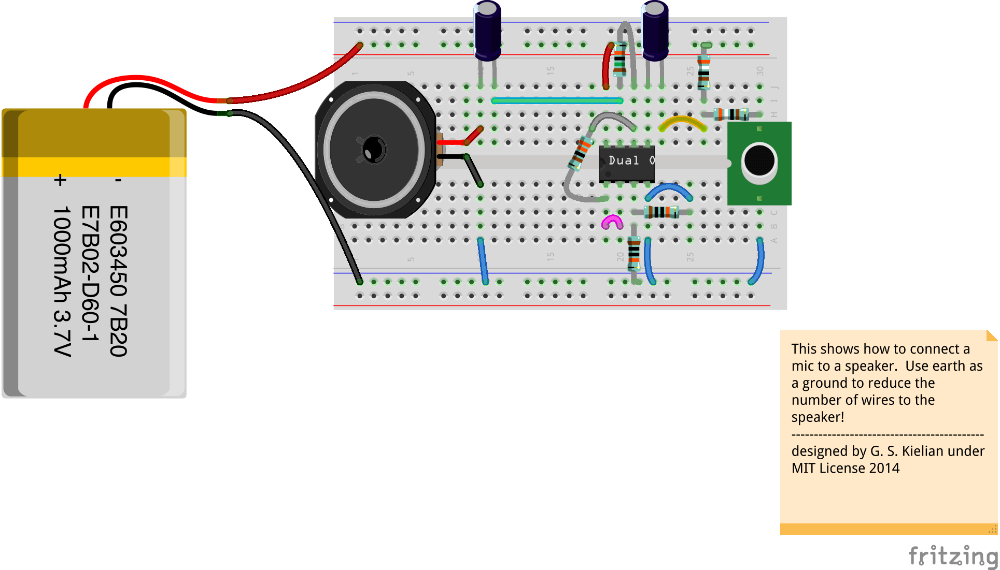
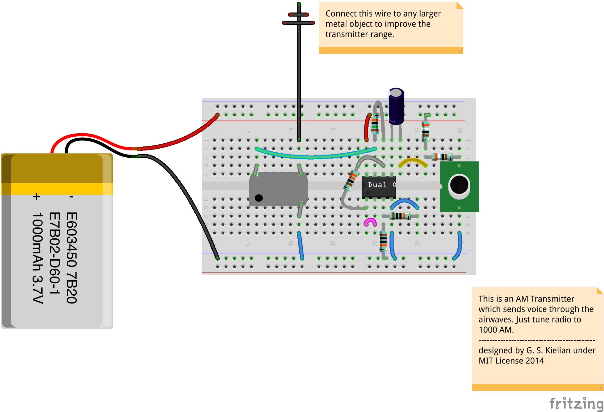

Maybe we should rename this to just radio stations?

might have a cooler ring to it.

Basically will be using this folder for following types of projects:

1\. microphone amplifiers

To amplify a microphone, one needs to run some current through it (at matched impedence) and then send the output to an amplifier.  In the following case we use an OpAmp, which you will soon use pretty much always.

The following is an example of how to amplify a mic and send the output to a speaker.

BOM
* 2x 10uF capacitors (electrolytic most likely)
* 2x 100k resistors for voltage divider
* 2x 3.9k resistors for impedence on electret mic line
* small resistor and big resistor ( ratio of about 1:100 ) for the non-inverting amp stage
* Speaker
* 3.7V Lipo

2\. speaker actuation

3\. the AM radio bridge

We control the amplitude of the 1MHz signal with the oscillator can.

BOM
* 2x 10uF capacitors (electrolytic most likely)
* 2x 100k resistors for voltage divider
* 2x 3.9k resistors for impedence on electret mic line
* small resistor and big resistor ( ratio of about 1:100 ) for the non-inverting amp stage
* Oscillator Can 1000KHz
* 3.7V Lipo

According to Hyperphysics:

> The Amplitude Modulated (AM radio) carrier frequencies are in the frequency range 535-1605 kHz. Carrier frequencies of 540 to 1600 kHz are assigned at 10 kHz intervals. The FM radio band is from 88 to 108 MHz between VHF television Channels 6 and 7.

Basically we can start by building basic AM radio bridges using the following strategies

First circuits

> 555 + Speaker

> 555 + Crystal Oscillator + antennae

> sound source + transformer + crystal oscillator + antennae

> sound source + op-amp + antennae

We will need bigger 
