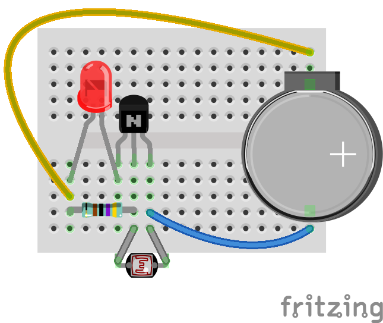

Circuits and descriptions
-------------------------

## LED-Light-02-v2

## LED-Light-02

## LED-Light-03-Switch

## LED-Light-04-Resistor

## LED-Light-05-Switch-Resistor

## LED-Light-06-Night-Light

## LED-Light-07-Dimmer

## LED-Light-08-Dimmer-Switch

## LED-Light-09-Red-Light-Green-Light

## LED-Light-10-Potentiometer-Red-Light-Green-Light

## LED-Light-10a-Potentiometer-Red-Light-Green-Light

